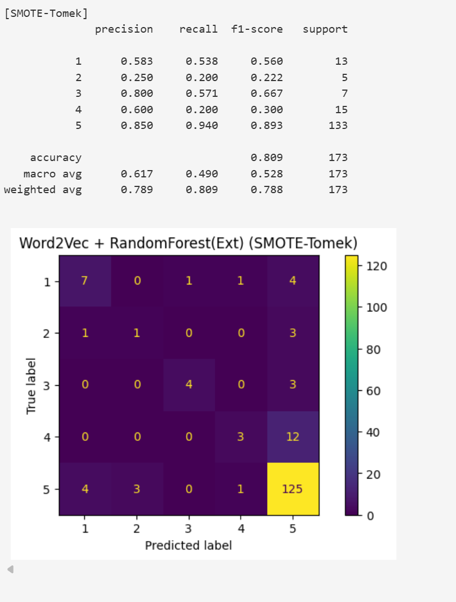

# 🎮 Game Review Rating Prediction using Text Mining

---

## 📌 Project Overview

This project aims to build a machine learning model to predict game review ratings (1–5 stars) based on English user reviews scraped from Google Play Store.

The main objective is to compare different text representation techniques and machine learning models, including the impact of handling imbalanced data using SMOTE and SMOTE-Tomek.

---

## 📊 Dataset

- 1000 English game reviews
- Ratings: 1–5 stars
- Scraped from Google Play Store
- Final test size: 173 samples

The dataset exhibits class imbalance, where rating 5 dominates the distribution.

---

## 🧹 Text Preprocessing

The following preprocessing steps were applied:

- Lowercasing
- Tokenization
- Stopword removal
- Lemmatization
- Cleaning non-standard words
- Normalization

Goal: Preserve semantic meaning while improving token effectiveness.

---

## 🧠 Text Representation Methods

Two representation techniques were compared:

### 1️⃣ TF-IDF
Represents word importance within a document.

### 2️⃣ Word2Vec (Context-Based ANN)
Word vectors trained based on surrounding words (semantic representation).

---

## 🤖 Machine Learning Models

Two machine learning algorithms were tested:

- Logistic Regression
- Random Forest (Extra Trees variant)

Each model was tuned using at least two hyperparameters.

---

## ⚖ Handling Imbalanced Data

To address class imbalance:

- SMOTE
- SMOTE-Tomek

Models were retrained and re-evaluated.

---

## 📈 Best Model Result

🏆 **Best Model:** Word2Vec + RandomForest (Ext) with SMOTE-Tomek

### Classification Report

Accuracy: **0.809**  
Macro F1-score: **0.528**  
Weighted F1-score: **0.788**

| Class | Precision | Recall | F1-score | Support |
|-------|-----------|--------|----------|---------|
| 1     | 0.583     | 0.538  | 0.560    | 13      |
| 2     | 0.250     | 0.200  | 0.222    | 5       |
| 3     | 0.800     | 0.571  | 0.667    | 7       |
| 4     | 0.600     | 0.200  | 0.300    | 15      |
| 5     | 0.850     | 0.940  | 0.893    | 133     |

---

## 🔍 Confusion Matrix

Observation:
- Class 5 is still dominant
- Minority class recall improved compared to baseline
- More balanced distribution after SMOTE-Tomek

---

## 📊 Key Insights

- Baseline model achieved higher accuracy (0.821) but was heavily biased toward class 5.
- SMOTE and SMOTE-Tomek slightly reduced accuracy but improved macro recall.
- Macro-F1 remained relatively stable (~0.53), indicating better class balance.
- Handling imbalance improves fairness without significant loss in global performance.

---

## 🏁 Final Conclusion

- Word2Vec outperformed TF-IDF in capturing contextual meaning.
- RandomForest (Ext) provided the best predictive performance.
- SMOTE-Tomek improved minority class recognition.
- Balancing is beneficial when fairness across classes is important.

---

## 🎥 Video Explanation

[https://drive.google.com/file/d/13nkTuV_-HN2x-VEQBman0V0m0rgOhFEU/view?usp=sharing]

