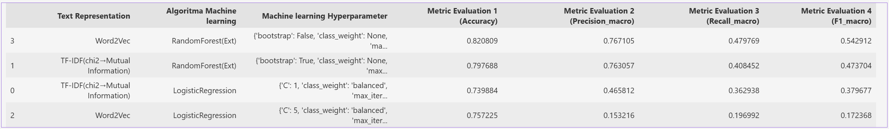

🎮 Game Review Rating Prediction (Text Mining Project)

📌 Project Background
    This project aims to build a machine learning model to predict game review ratings based on English user reviews scraped from Google Play Store.
    The objective is to compare different text representation methods and evaluate their predictive performance, including handling imbalanced data.

📊 **Dataset**
- 1000 English game reviews
- Various rating levels (1–5)
- Scraped from Google Play Store

🔎 **Exploratory Data Analysis**
- Dominant words per rating
- Frequency of non-standard words
- Word cloud visualization

🧹 **Text Preprocessing**
Steps:
- Lowercasing
- Tokenization
- Stopword removal
- Lemmatization
- Cleaning non-standard words

🧠 **Text Representation Methods**

1️⃣ TF-IDF

Vector representing word importance in document.

2️⃣ Word2Vec (ANN-based context representation)

Vector learned based on surrounding words.

🤖 **Machine Learning Models**
Two ML algorithms were applied:
- Model 1: Logistic Regression
- Model 2: Random Forest
Each model tuned with at least two hyperparameters.

📈 **Performance Evaluation**
Metrics used:
- Accuracy
- Precision
- Recall
- F1-score
Performance Comparison

